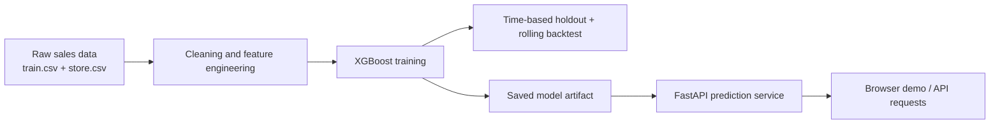
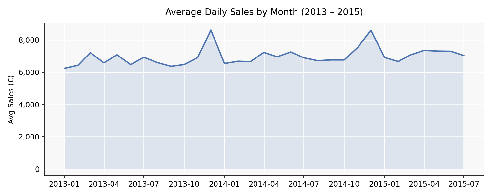
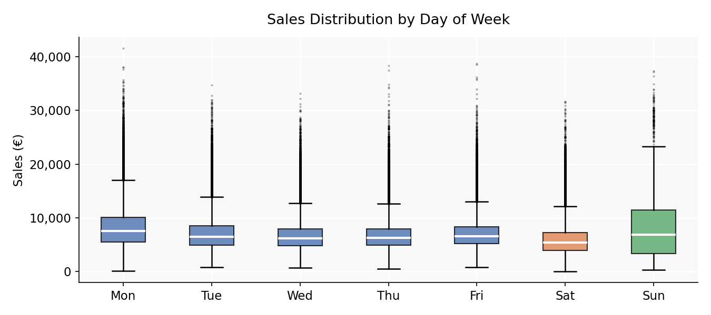
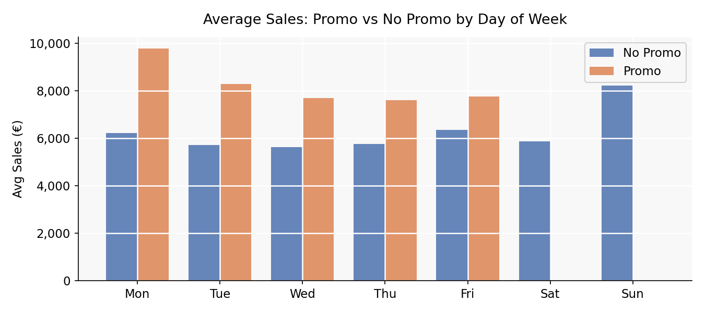
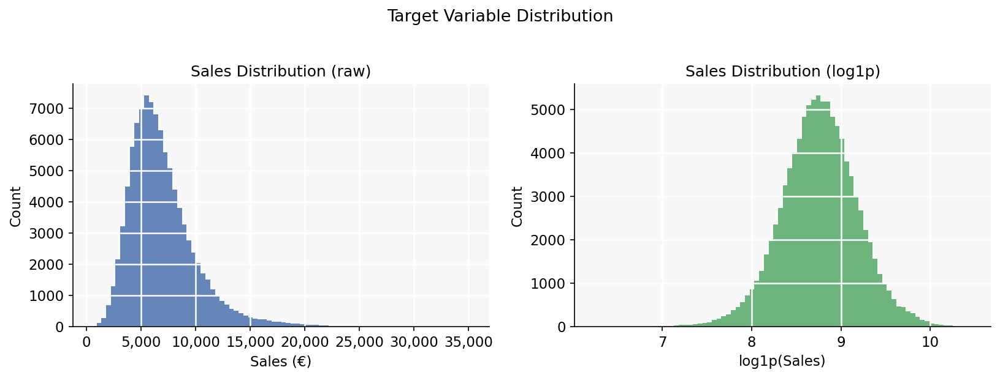

# Rossmann Store Sales Forecasting

This repository is a small end-to-end machine learning and MLOps learning project built around the Rossmann Store Sales dataset. The goal is to predict daily store sales from tabular retail data, evaluate the model with time-aware validation, and expose the trained model through a lightweight API and demo interface.

Live demo: [Hugging Face Space](https://huggingface.co/spaces/ymlin105/Rossmann-Store-Sales)

## Overview

This project focuses on a compact but complete forecasting workflow:

- merge historical sales with store metadata
- engineer calendar, holiday, and store-level features
- train an XGBoost regressor on `log1p(Sales)`
- evaluate with a strict time-based holdout split and rolling backtests
- track runs locally with MLflow
- serve predictions through FastAPI and a small browser demo

I kept the project intentionally small. The emphasis is not on building a large platform, but on showing a coherent ML workflow with a thin deployment layer.

## Demo Snapshot


## Workflow



## Method

The prediction target is daily store sales `Sales`. The dataset comes from the Rossmann Kaggle competition and uses `train.csv` plus `store.csv`, with `1,017,209` raw rows and `844,338` rows after removing closed stores and zero-sales records.

The pipeline fills missing competition and promo fields, encodes store and holiday categories, and trains on `log1p(Sales)`. The final feature set has `28` columns built from:

- calendar features such as `DayOfWeek`, `Month`, and `IsWeekend`
- promotion and holiday indicators such as `Promo`, `StateHoliday`, and `SchoolHoliday`
- store metadata such as `StoreType`, `Assortment`, and `CompetitionDistance`
- engineered signals such as `LogCompetitionDistance`, Easter features, and Fourier seasonality terms

The model is an XGBoost regressor. This keeps the project compact while still fitting the tabular structure of the problem well.

Current training parameters:

```yaml
n_estimators: 500
learning_rate: 0.05
max_depth: 10
subsample: 0.8
colsample_bytree: 0.8
objective: reg:squarederror
random_state: 42
```

Validation uses the last `42` days as a holdout window (`2015-06-20` to `2015-07-31`) plus `3` rolling backtest windows. The main evaluation metric is `RMSPE`.

## Data Analysis

### Sales Trend

Monthly average daily sales across the full dataset period. The seasonal pattern is visible, with a consistent peak towards the end of each year.



### Sales by Day of Week

Sunday stores are closed in most cases, so Saturday carries the highest median sales. Weekday distributions are relatively tight compared to the weekend spread.



### Promotion Effect

Promotions lift average sales on every weekday. The effect is strongest on Monday and weakest on Saturday, where foot traffic is already high.



### Target Distribution

Raw sales are right-skewed. The `log1p` transformation used during training produces a near-normal distribution, which is better suited for regression.



## Results

Performance is evaluated with `RMSPE`, which is a useful relative error metric for store sales forecasting. The project uses a strict 42-day time-based holdout split instead of a random train/validation split, and also runs 3 rolling backtests to check whether gains remain stable across multiple forecast windows. Model performance is always compared against a simple historical baseline built from store and day-of-week averages.

### Holdout Results

| Method | Train RMSPE | Validation RMSPE | Notes |
| --- | ---: | ---: | --- |
| Baseline | - | 23.5604 | Store and day-of-week historical mean |
| Pre-tuning XGBoost | 18.3328 | 16.0662 | Initial configuration |
| Tuned XGBoost | 11.3646 | 12.8545 | Final selected model |

### Rolling Backtest Summary

| Metric | Value |
| --- | ---: |
| Average tuned RMSPE | 13.2412 |
| Average baseline RMSPE | 22.9997 |
| Average improvement vs baseline | 9.7585 |

### What these results mean

- The tuned model improves over the simple baseline by about `10.71` RMSPE points on the final holdout window.
- Across `3` rolling windows, the tuned model remains consistently better than the baseline.
- The weakest backtest window is `2015-05-09` to `2015-06-19`, which suggests the model is more sensitive in some seasonal or promotion periods than others.

## What This Project Demonstrates

- tabular forecasting with explicit feature engineering
- time-aware evaluation through holdout and rolling backtests
- local MLflow tracking, saved model artifacts, and model metadata
- FastAPI serving, Dockerized local inference, CI checks, and offline drift checks

## Project Structure

```text
src/training/    data loading, feature engineering, split helpers, model training
src/serving/     FastAPI prediction service and inference logging
src/shared/      config, MLflow helper, and API schemas
scripts/         evaluation, drift check, and test runner
web/             minimal browser demo
metrics/         saved training and evaluation outputs
tests/           unit tests for pipeline, serving, and split logic
Dockerfile       minimal container image for inference
```

## How To Run

Install dependencies:

```bash
pip install -r requirements.txt
```

Train the model:

```bash
make train
```

Run evaluation:

```bash
make evaluate
```

This writes:

- `models/rossmann_model.json`
- `models/model_metadata.json`
- `metrics/training_summary.json`
- `metrics/model_evaluation.json`

If `mlflow` is installed, training and evaluation runs are also logged locally under `mlruns/`.

Run the API demo:

```bash
make run
```

Then open [http://localhost:7860](http://localhost:7860).

Run tests:

```bash
make test
```

Build the Docker image for local inference:

```bash
make docker-build
make docker-run
```

Generate an offline drift report from logged inference requests:

```bash
make drift-check
```

## Limitations

- This is a compact forecasting and deployment demo, not a production system.
- Feature engineering is intentionally simple and mostly manual.
- The explanation output is a model contribution view, not a causal interpretation.
